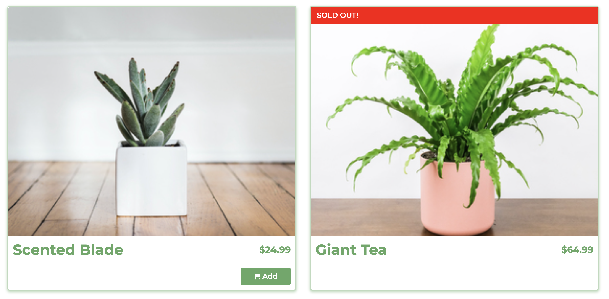

# Jungle

Jungle is an e-commerce application with features such as product listings, product categories, user authentication, order management, and admin functionality. It is built using Ruby on Rails framework.

## Dependencies

- Rails 6.1 [Rails Guide](http://guides.rubyonrails.org/v6.1/)
- Bootstrap 5
- PostgreSQL 9.x
- Stripe

## Images

### Homepage 

### Product listings

### Cart

